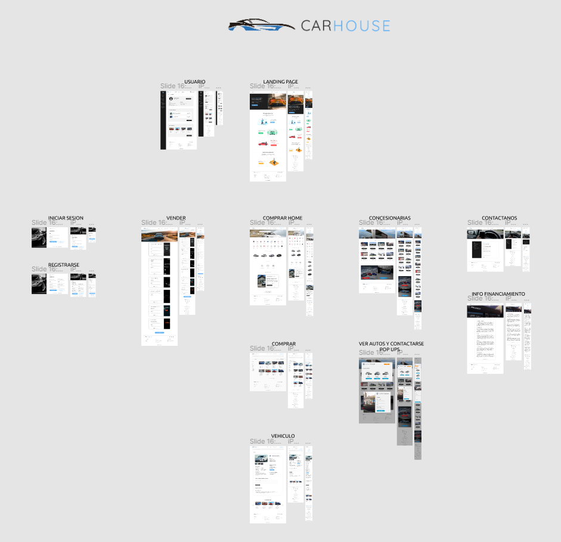

CarHouse is a website for buying and selling vehicles. In it you can search among a large number of used vehicles published by other users as well as publish your vehicle for sale. You can also search for vehicles 0 km offered by the wide variety of dealerships found here. If you have a dealership you can register it on the site as well.
<<<<<<< HEAD

# Pages

1. **`Landing Page`** (Welcome page)
2. **`Buy`** (Search for a vehicle)
3. **`Sell`** (Sell your vehicle)
4. **`Dealerships`** (Look at cars offered by dealers)
5. **`Sign In / Sign Up`** (Create an account or login)
6. **`Contact`** (Contact us, register your dealership)
7. **`My Profile`** (Your basic information, users can see their cars posted for sale and favorites)

# **UI/UX Design**

### `Full responsive and modern design`

To obtain this **great result**, I designed each page and each element of this website in a complete and detailed way. To carry out this task I use [**Figma**](https://www.figma.com/).


Global Design

# Technical Information

### `1. RWD using media queries`

In order to achieve a full responsive website that that can be perfectly seen from a computer, tablet or cell phone, mainly media queries, grids and flexbox were used.

```css
/* Favorite cars section responsive using grid and media queries */
.favs-cars {
    display: grid;
    column-gap: 1rem;
    row-gap: 3rem;
    width: 100%;
    margin: 4rem 0;

    .card-car {
        background-color: $white;
    }
}

@media (min-width: 625px) {
    .favs-cars {
        grid-template-columns: repeat(2, 1fr);
    }
}

@media (min-width: 1200px) {
    .favs-cars {
        grid-template-columns: repeat(4, 1fr);
        column-gap: 2rem;
    }
}
```

### `2. No CSS Framework`

No CSS Framework was used to develop this website. 

## Languages

* **`HTML5`** (Standard markup language for Web pages)
* **`CSS3`** (Cascading Style Sheets (CSS) is a style sheet language used for describing the presentation of a document written in a markup language such as HTML or XML)
* **`SASS`** (Preprocessor scripting language that is interpreted or compiled into CSS)
* **`JavaScript`** (World's most popular programming language and the programming language of the Web)

## Libraries

* **`Font Awesome`** (Icon library and toolkit, used by millions of designers, developers, and content creators)
* **`AOS (Animate On Scroll)`** (This library allows you to animate elements as you scroll down and up)

# General Information

### `Final Project of Coderhouse Web Development Course`

* Developed by: **Mathias Ramilo**

### **Personal Data**

* Visit my [**GitHub**](https://github.com/mathiramilo) profile to see more amazing projects.
* If you are interested, contact me on [**Linkedin**](https://www.linkedin.com/in/mathias-ramilo/).
